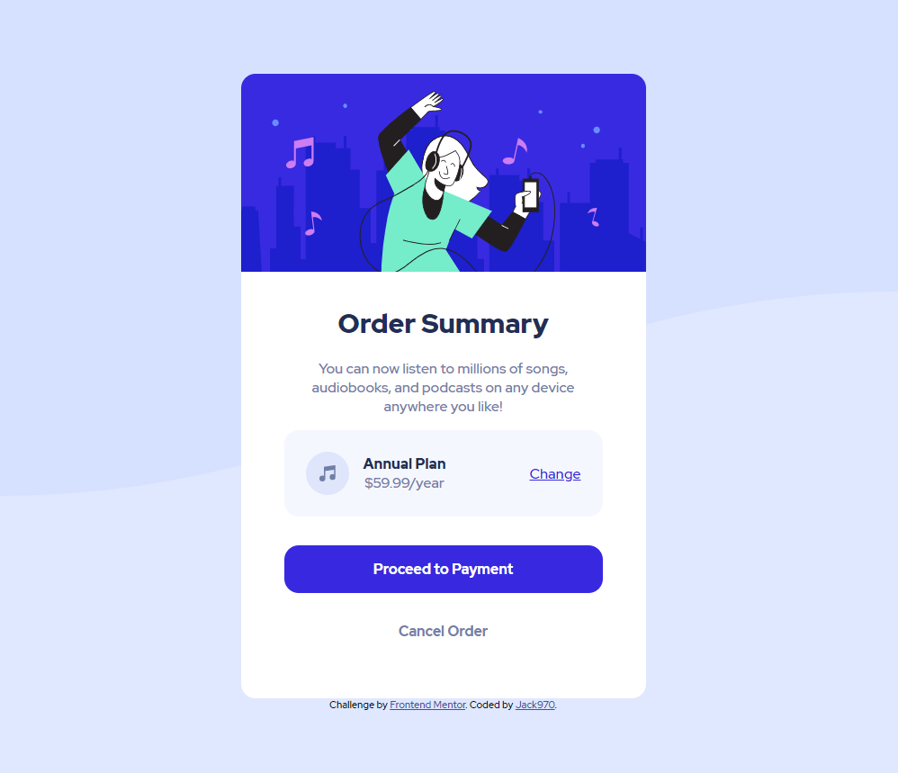

# Frontend Mentor - Order summary card solution

This is a solution to the [Order summary card challenge on Frontend Mentor](https://www.frontendmentor.io/challenges/order-summary-component-QlPmajDUj). Frontend Mentor challenges help you improve your coding skills by building realistic projects. 

## Table of contents

- [Frontend Mentor - Order summary card solution](#frontend-mentor---order-summary-card-solution)
  - [Table of contents](#table-of-contents)
  - [Overview](#overview)
    - [Screenshot](#screenshot)
    - [Links](#links)
  - [My process](#my-process)
    - [Built with](#built-with)
    - [What I learned](#what-i-learned)
  - [Author](#author)

## Overview

### Screenshot



### Links

- Solution URL: [my solution here](https://prnt.sc/1ro4ixa)
- Live Site URL: [live site here](https://page-music.netlify.app)

## My process

### Built with

- Semantic HTML5 markup
- CSS custom properties
- Flexbox
- Mobile-first workflow
### What I learned

i have added Global Variables in scope from css to manipulate the colors from the page.

```css
:root {
    /* PRIMARY COLORS */
    --pale-blue: hsl(225, 100%, 94%);
    --bright-blue: hsl(245, 75%, 52%);

    /* NEUTRAL COLORS */
    --very-pale-blue: hsl(225, 100%, 98%);
    --desaturated-blue: hsl(224, 23%, 55%);
    --dark-blue: hsl(223, 47%, 23%);
}
```
## Author

- Website - [page-music.netlify.app](page-music.netlify.app)
- Frontend Mentor - [@jack970](https://www.frontendmentor.io/profile/jack970)
